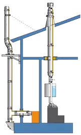
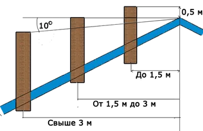

## Как проходит монтаж

Монтаж дымохода начинается не с трубы, а с выезда специалиста: он осматривает котёл или печь, подбирает место и способ установки под особенности дома. Дальше — проект и спецификация: полный список элементов, чертежи, точный объём работ. Всё изготавливаем на собственном производстве, привозим на объект и монтируем. В конце проверяем тягу и герметичность — сдаём рабочую систему, а не набор труб.

## Два способа установки

Дымоход из нержавеющей стали ставят одним из двух способов. Первый — отдельная труба по фасаду или внутри дома: котёл или камин подключается к ней сбоку через тройник. Второй — труба поднимается вертикально прямо над топкой, без поворотов: элементов меньше, система дешевле и не занимает лишнего места. Какой способ подходит вашему дому, специалист определяет при осмотре.

## Высота трубы и тяга

Ошибки в дымоходе не прощаются: заниженная труба или лишний поворот дают слабую или обратную тягу, и дым идёт в дом. Минимальная высота от топки — 5 метров, на практике обычно 7–8. Высота над кровлей зависит от расстояния до конька: ближе 1,5 метра — труба должна быть выше конька минимум на полметра, от 1,5 до 3 метров — не ниже конька, дальше — не ниже линии, проведённой от конька вниз под углом 10°.

## Крепление и проходы

Трубу ведём максимально вертикально и крепим кронштейнами с хомутами с шагом около двух метров; для тяжёлой системы шаг уменьшаем. В местах контакта с перекрытиями ставим проходные узлы с негорючей изоляцией — деревянные конструкции защищены от нагрева. Выход через кровлю закрываем уплотнением: его верхний край заводим под покрытие на 100–150 мм, чтобы стык не тёк даже в сильный дождь.

## Что входит в услугу

- Консультация и выезд на объект.
- Проектирование системы дымоотведения и спецификация.
- Изготовление всех элементов и доставка.
- Монтаж любой сложности: гильзовка кирпичных каналов, фасадные и внутренние дымоходы.
- Ремонт дымоходов и вентиляционных каналов.

Работаем по Минску и области. Оставьте заявку — рассчитаем стоимость по вашему объекту.
